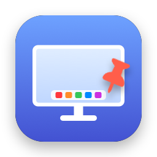

<p align="center">
  
</p>

<h1 align="center">StickyDock</h1>

<p align="center">Keep the macOS Dock on the monitor you choose.</p>

---

With more than one display, macOS moves the Dock to whichever screen you bump the
bottom edge of. StickyDock lets you pick one display and keeps the Dock there. It runs
quietly in the background, and it keeps working when you plug in or unplug monitors.

- Choose the Dock's display from a list
- Works with the Dock on the bottom, left, or right, and with auto-hide
- If your chosen display is unplugged, the Dock stays on your main display and moves back when you reconnect it
- Optionally hide the Dock and menu bar icons while it runs
- Launch at login
- Free and open source, with no network access and no data collection

Requires macOS 13 Ventura or later, on Apple silicon or Intel Macs.

## Install

1. Download `StickyDock-x.y.z.dmg` from the [latest release](https://github.com/amarchakitus/stickydock/releases/latest).
2. Open the DMG and drag **StickyDock** into **Applications**.
3. Open StickyDock from Applications. macOS will block it the first time (see below).

### "StickyDock can't be opened" / "Apple could not verify…"

StickyDock isn't notarized by Apple (that requires a paid developer account), so macOS
blocks it the first time you open it. To allow it:

1. Try to open StickyDock and click **Done** on the warning.
2. Open **System Settings → Privacy & Security** and scroll down to **Security**.
3. Next to *"StickyDock" was blocked…*, click **Open Anyway** and confirm with your password.

You only need to do this once. If you're comfortable with Terminal, this does the same thing:

```sh
xattr -dr com.apple.quarantine /Applications/StickyDock.app
```

### Allow Accessibility access

StickyDock asks for Accessibility access when it first opens. Turn on StickyDock in
**System Settings → Privacy & Security → Accessibility**. The app starts working as
soon as you allow it. You don't need to restart it.

## Use

Pick a display under **Keep Dock on**, then close the window. StickyDock keeps running
in the background.

To change settings later, open StickyDock again (from Applications, Spotlight, or
Launchpad), or use the menu bar icon if you've left it on. **Quit StickyDock** is at the
bottom of the window.

| Setting | What it does |
| --- | --- |
| Lock the Dock to this display | Turns StickyDock's protection on or off without quitting. |
| Keep hot corners working on other displays | Leaves the corners of the other displays reachable so hot corners still work. Pushing hard into a corner may occasionally move the Dock. |
| Move Dock Now | Moves the Dock to your chosen display straight away. |
| Show icon in Dock / menu bar | Turn both off to run invisibly. Open the app again to get the window back. |
| Launch at login | Starts StickyDock in the background when you log in. |

## How it works, and why it needs Accessibility

macOS has no setting or API for which display the Dock is on. The Dock simply moves to
the screen where you push the cursor against its edge. So StickyDock:

1. **Stops the cursor 2 pixels short of the Dock edge** on every display except the one
   you picked, so the Dock is never triggered there. Edges where two monitors meet aren't
   affected, so you can still move the cursor between screens.
2. **Moves the Dock back if it ends up elsewhere** (for example after you connect a
   display). It briefly moves the cursor to your chosen display's edge, then puts the
   cursor back.

Both steps need Accessibility access, because watching and adjusting cursor movement is
an Accessibility feature. StickyDock only looks at cursor position. It never reads
keyboard input, makes no network connections, and collects nothing. All of that logic is
in [`Sources/DockLocker.swift`](Sources/DockLocker.swift) if you want to check.

## Troubleshooting

**Accessibility is turned on but nothing happens.** Select StickyDock in the
Accessibility list, remove it with **–**, then add `/Applications/StickyDock.app` again
with **+**. This can happen if you moved or replaced the app.

**The Dock still moves to another display.** Click **Move Dock Now**. If it keeps
happening, please [open an issue](https://github.com/amarchakitus/stickydock/issues/new/choose)
and include the output of **Copy Debug Info** (bottom of the window).

**Hot corners stopped working on my other displays.** Turn on **Keep hot corners working
on other displays**.

**I hid both icons and can't find the app.** Open StickyDock again from Applications or
Spotlight and the window comes back.

## Uninstall

Quit StickyDock (from its window or menu bar icon), delete it from Applications, then
optionally remove its permission and settings:

```sh
tccutil reset Accessibility io.github.amarchakitus.stickydock
defaults delete io.github.amarchakitus.stickydock
```

If you turned on **Launch at login**, turn it off before deleting the app, or remove
StickyDock from **System Settings → General → Login Items** afterwards.

## Building from source

You need the Xcode Command Line Tools (`xcode-select --install`).

```sh
git clone https://github.com/amarchakitus/stickydock.git
cd stickydock
./scripts/make_cert.sh   # once: local signing certificate (see below)
./build.sh install       # build a universal app and copy it to /Applications
```

`./build.sh` on its own builds `build/StickyDock.app`, and `./build.sh release` also
creates the `.zip` and `.dmg`.

`scripts/make_cert.sh` creates a self-signed "StickyDock Local Signing" certificate in
your login keychain. When every build is signed with the same certificate, macOS keeps
the Accessibility permission across rebuilds. Without it, builds are ad-hoc signed and
you have to grant the permission again after each rebuild.

### Releasing

Bump `CFBundleShortVersionString` in `Info.plist`, commit, then push a matching tag:

```sh
git tag v1.0.1 && git push origin v1.0.1
```

The [release workflow](.github/workflows/release.yml) builds the app and publishes a
GitHub Release with the DMG and zip. To sign releases with your certificate, so users
keep their Accessibility permission when they update, add it as repository secrets
once (`make_cert.sh` prints these commands):

```sh
base64 -i ~/.stickydock-signing/signing.p12 | gh secret set SIGNING_CERT_P12
gh secret set SIGNING_CERT_PASSWORD < ~/.stickydock-signing/password.txt
```

Keep `~/.stickydock-signing` private and backed up. If you lose it, the next release
has a different signature and users have to grant the permission again once.

## License

[MIT](LICENSE)
